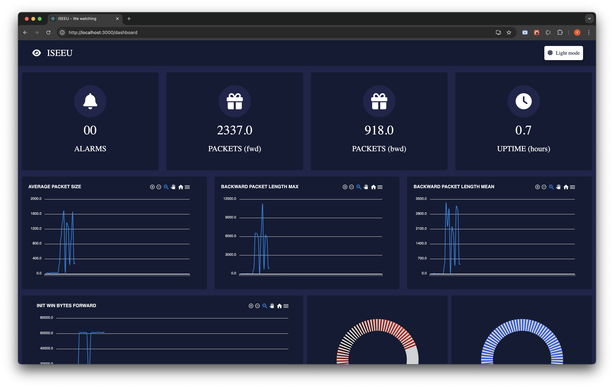
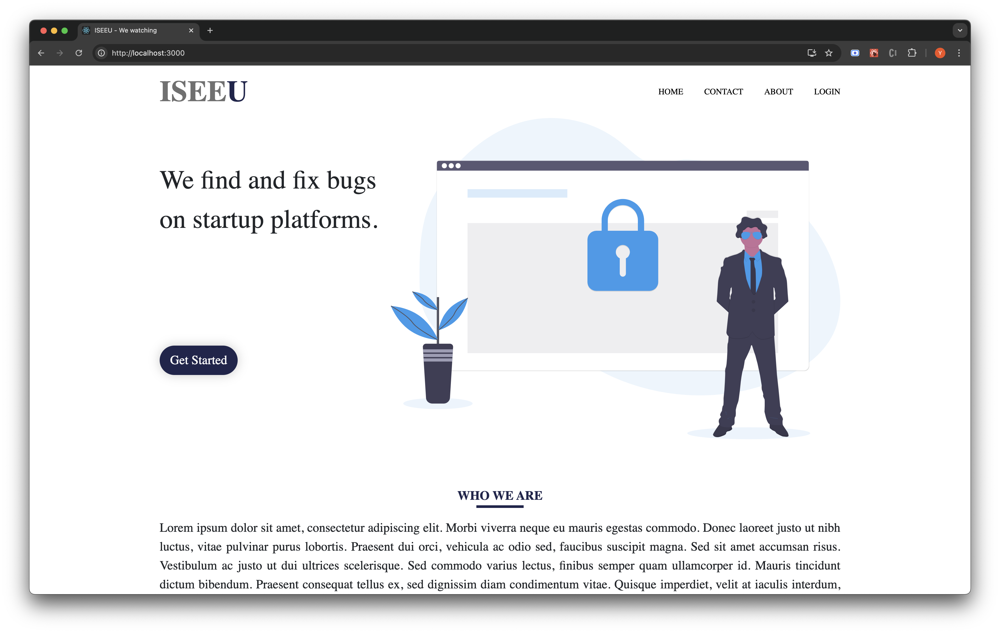
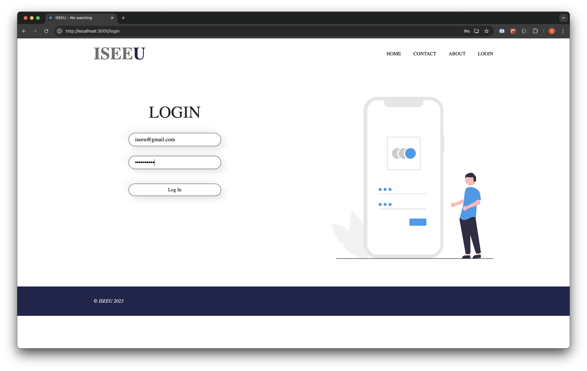
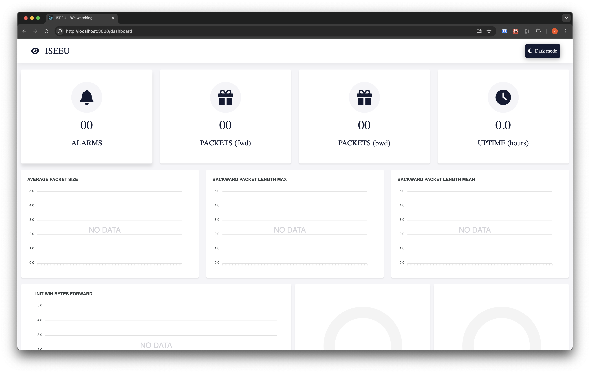
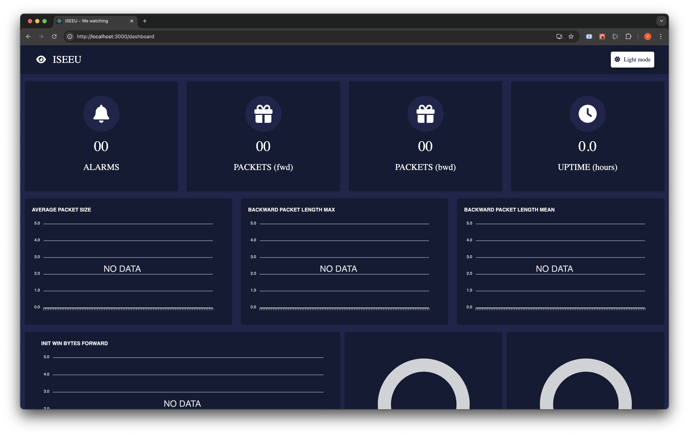

# ISEEU

## Brief Description

ISEEU is a project executed by the MSc. Big Data Analysis students of ST Josephs University Bangalore as their second semester multivariate statistics project. The main aim of this project was to understand PCA (Principle Component Analysis), a dimensionality reduction technique and how it could be used for anomaly detection. For more details, read our project report.

> **DISCLAIMER:** In the final project, PCA was not used for anomaly detection due to certain issues. Visit our white paper to understand what happened.

## Main Modules

This web application is made up of two main modules;

1. Backend: This was build in flask to deploy our model, send alerts and also to simulate traffic flow in a network using web sockets.

2. Frontend: A user interface build with ReactJS to display the data streamed from the backend.

## How to run the backend module

1. Clone repository `git clone https://github.com/aljoindia/iseeu.git`.
2. Navigate to the `backend/` directory and run the command `pip install -r requirements.txt` to install dependencies. It is advisable to install these dependencies in a virtual environment. Use `virtualenv venv` to create an environment and `source venv/bin/activate` to activate your environment.
3. In your terminal, use `python main.py` to start the server. In the main folder, make changes to the path to the various models and csv files used.
4. Your backend is ready!!!

## How to run the frontend module

1. Navigate to `iseeu-frontend/` and run the comman `npm install` to install the dependencies.
2. Run `npm start` to run the react application.
3. Use `ctrl + shift + s` to connect user interface to the backend.
4. You should now see the dashboard being updated with data from the backend.

## Setting up email notifications

1. In `backend/iseeu_modules/alert_sender.py`, add sender email, password. Do not use your email password to run this application. Go to [Sign in with App passworeds](https://support.google.com/mail/answer/185833?hl=en) and generate a password for this application.
2. Go to `backend/data/emails.csv` and add the emails you would want to receive alerts on.

> *Please use only your emails lest you spam someone. Thank you :)*

## Images

|   |   |   |
|---------------------------|---------------------------|---------------------------|
|   |   |   |